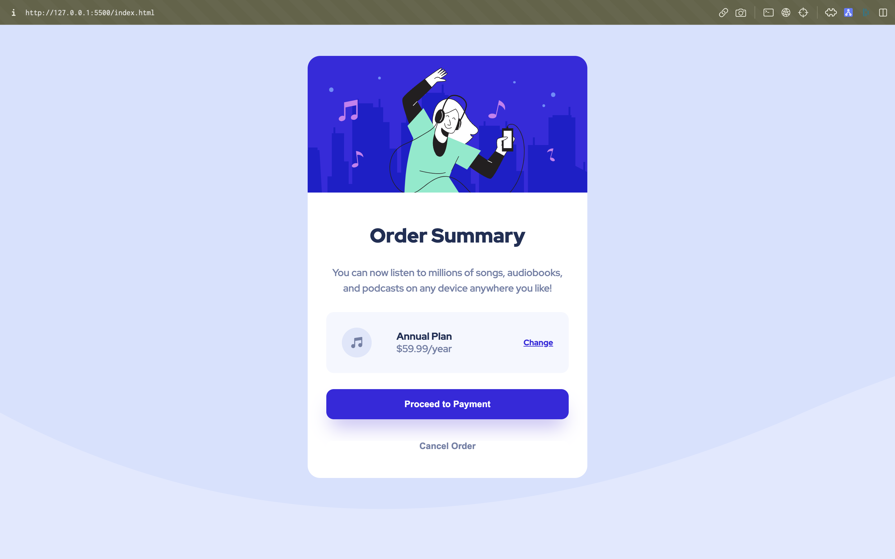

# Frontend Mentor - Order summary card solution

This is a solution to the [Order summary card challenge on Frontend Mentor](https://www.frontendmentor.io/challenges/order-summary-component-QlPmajDUj). Frontend Mentor challenges help you improve your coding skills by building realistic projects. 

## Table of contents

- [Overview](#overview)
  - [The challenge](#the-challenge)
  - [Screenshot](#screenshot)
  - [Links](#links)
- [My process](#my-process)
  - [Built with](#built-with)
  - [What I learned](#what-i-learned)
- [Author](#author)


## Overview

### The challenge

Users should be able to:

- View the optimal layout depending on their device's screen size
- See hover and focus states for interactive elements

### Screenshot




### Links

- Solution URL: [https://github.com/pradhyumna186/product-preview-card-component-main](https://github.com/pradhyumna186/## Table of contents

- [Overview](#overview)
  - [The challenge](#the-challenge)
  - [Screenshot](#screenshot)
  - [Links](#links)
- [My process](#my-process)
  - [Built with](#built-with)
  - [What I learned](#what-i-learned)
- [Author](#author)


## Overview

### The challenge

Users should be able to:

- View the optimal layout depending on their device's screen size
- See hover and focus states for interactive elements

### Screenshot


### Links

- Solution URL: [https://github.com/pradhyumna186/product-preview-card-component-main](https://github.com/pradhyumna186/product-preview-card-component-main)
- Live Site URL: [https://pradhyumna186.github.io/product-preview-card-component-main/](https://pradhyumna186.github.io/## Table of contents

- [Overview](#overview)
  - [The challenge](#the-challenge)
  - [Screenshot](#screenshot)
  - [Links](#links)
- [My process](#my-process)
  - [Built with](#built-with)
  - [What I learned](#what-i-learned)
- [Author](#author)


## Overview

### The challenge

Users should be able to:

- View the optimal layout depending on their device's screen size
- See hover and focus states for interactive elements

### Screenshot


### Links

- Solution URL: [https://github.com/pradhyumna186/order-summary-component-main](https://github.com/pradhyumna186/order-summary-component-main)
- Live Site URL: [https://pradhyumna186.github.io/order-summary-component-main/](https://pradhyumna186.github.io/order-summary-component-main/)

## My process

### Built with

- Semantic HTML5 markup
- CSS custom properties
- Flexbox
- CSS Grid
- Mobile-first workflow


### What I learned

```html
<h1>Some HTML code I'm proud of</h1>
```
```css
.proud-of-this-css {
  color: papayawhip;
}
```
```js
const proudOfThisFunc = () => {
  console.log('🎉')
}
```
## Author

- Website - Pradhyumna Reddy(https://github.com/pradhyumna186)
- Frontend Mentor - [@pradhyumna186](https://www.frontendmentor.io/profile/pradhyumna186)
- Twitter - [@pradhyumna186](https://twitter.com/Pradhyumna186)

/)

## My process

### Built with

- Semantic HTML5 markup
- CSS custom properties
- Flexbox
- CSS Grid
- Mobile-first workflow


### What I learned

```html
<h1>Some HTML code I'm proud of</h1>
```
```css
.proud-of-this-css {
  color: papayawhip;
}
```
```js
const proudOfThisFunc = () => {
  console.log('🎉')
}
```
## Author

- Website - Pradhyumna Reddy(https://github.com/pradhyumna186)
- Frontend Mentor - [@pradhyumna186](https://www.frontendmentor.io/profile/pradhyumna186)
- Twitter - [@pradhyumna186](https://twitter.com/Pradhyumna186)

)
- Live Site URL: [https://pradhyumna186.github.io/product-preview-card-component-main/](https://pradhyumna186.github.io/product-preview-card-component-main/)

## My process

### Built with

- Semantic HTML5 markup
- CSS custom properties
- Flexbox
- CSS Grid
- Mobile-first workflow


### What I learned

```html
<h1>Some HTML code I'm proud of</h1>
```
```css
.proud-of-this-css {
  color: papayawhip;
}
```
```js
const proudOfThisFunc = () => {
  console.log('🎉')
}
```
## Author

- Website - Pradhyumna Reddy(https://github.com/pradhyumna186)
- Frontend Mentor - [@pradhyumna186](https://www.frontendmentor.io/profile/pradhyumna186)
- Twitter - [@pradhyumna186](https://twitter.com/Pradhyumna186)

